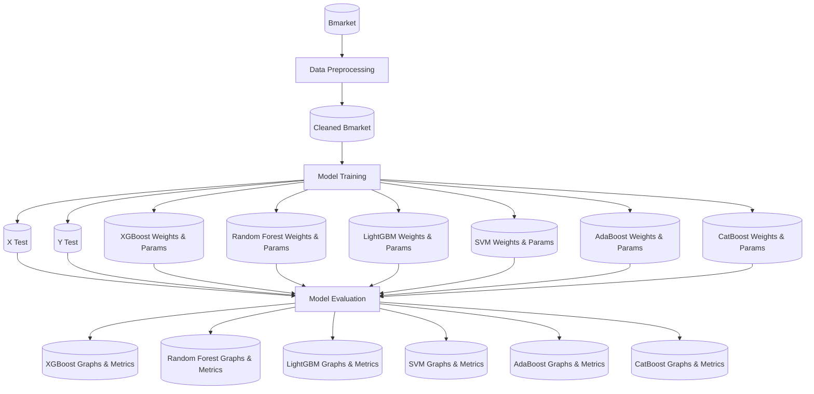
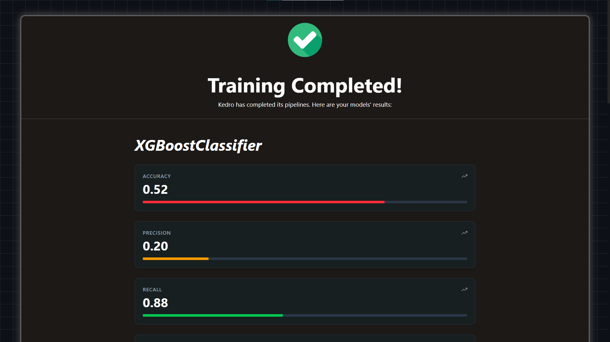

# EGT309 Team Harish Kanna

## Section A - Contributors

### Leong Jun Hoe - 230633N@mymail.nyp.edu.sg
- Data Preprocessing
- Feature Analysis
- Feature Engineering 

### Lee Ying Ray - 233466E@mymail.nyp.edu.sg
- Pipeline Development
- Pipeline Containerisation
- Repository Automation

Files to be marked: [hooks.py](src/egt309_pipeline/hooks.py), [main.py](visualisation-server/main.py)

### Zhang Zhe Xiang - 232842C@mymail.nyp.edu.sg
- Model Training
- Model Tuning
- Model Evaluation

## Section B - Folder Overview
```
EGT309-Team-Harish-Kanna                Folder Explanations:
├── conf                                <-- Pipeline Configuration
│   ├── base
│   │   └──parameters_model_config      <-- Model Parameter Configuration
│   └── local
├── data                                <-- Pipeline Data
│   ├── 01_raw
│   ├── 02_intermediate
│   ├── 03_primary
│   ├── 04_feature
│   ├── 05_model_input
│   ├── 06_models
│   ├── 07_model_output
│   └── 08_reporting
├── notebooks
├── saved_models                        <-- Models saved here after Evaluation 
│   ├── AdaBoostClassifier
│   ├── CatBoostClassifier
│   ├── LightGBMClassifier
│   ├── RandomForestClassifier
│   └── XGBoostClassifier
├── src
│   └── egt309_pipeline
│       └── pipelines                   <-- Individual Namespaced Pipelienes
│           ├── data_preparation
│           ├── model_evaluation
│           └── model_training
└── visualisation-server                <-- Webapp to view Model Results
```

## Section C - Instructions

### Prerequisites

- `docker` and `docker compose` must be installed.

### Steps to run Pipeline

For convenience, all images are present on DockerHub.

1.  Clone the repository and navigate to the project directory:
    ```bash
    git clone https://github.com/HigherGround189/EGT309-Team-Harish-Kanna.git
    cd EGT309-Team-Harish-Kanna
    ```
2.  Run "run.sh". It will will automatically pull the images from DockerHub, and launch the containers. 
    ```bash
    ./run.sh
    ```
> [!NOTE]
> You may need to run `chmod +x run.sh` before running it.

> [!TIP]
> If you want to <u>**build the images from source**</u> (instead of pulling images from DockerHub):
 ```bash
 docker compose up --build
```

### Steps to launch Development Server

_Assuming that the repository is already cloned:_

1.  Run "dev.sh". It will will automatically pull the development server image from DockerHub, and launch the container. 
    ```bash
    ./dev.sh
    ```
> [!NOTE]
> You may need to run `chmod +x dev.sh` before running it.

> [!TIP]
> If you want to <u>**build the image from source**</u> (instead of pulling it from DockerHub):
```bash
docker compose -f development.docker-compose.yml up --build
```

### Defining YAML configuration files for Model Training
The Pipeline's model training is designed such that you can train new models (as long as they inherit from scikit-learn's BaseEstimator class) solely by <u>**specifying the model's configuration in YAML files**</u> and <u>**installing the required package**</u>. This avoids the need to hardcode a new model class for each training run.

> [!NOTE]
> The naming of individual configuration files doesn't matter, as Kedro concatenates all configuration files into a single configuration dictionary during loading. In fact, it is possible to combine all model configurations into a single YAML file. However, for better organization, it is recommend to define each model's configuration in its own file, where the filename mirrors the root key (e.g.  `random_forest_config.yml` for the root key named `random_forest_config`).

#### Defining model training configuration
> [!IMPORTANT]
> It is highly recommend specifying model configurations within the [parameters_model_config](conf/base/parameters_model_config) directory. The root-level key for each model configuration can be named arbitrarily, as you'll reference it explicitly in the [model_registry_config.yml](conf/base/model_registry_config.yml) file. However, format `<model_name>_config` (e.g. `random_forest_config`) is suggested to define your root key.

**Each model configuration MUST follow this YAML schema:**
*   `class: str, required`  
        The full import path to the model's class (from scikit-learn or another library that inherits from scikit-learn's BaseEstimator class).

*   `data_encoding: {"ohe", "label", "none"}`, *default="ohe"* <br>
        Specifies the dataset encoding method. Offers "ohe" (One-Hot encoding), "label" (Lablel/Ordinal encoding) and "none" (no encoding on the dataset).

*   `requires_scaling: bool`, *default=False* <br>
        Set to true if the model is distance-based (e.g., KNN, SVM) and requires feature scaling for optimal performance. Defaults to false.

*   `model_params: dict`, optional <br>
        A nested dictionary of hyperparameters to pass to the model constructor. It should be all the parameters that will be kept constant and not passed to bayesian search. It should match the paramaters accepted by the model class __init__ method (e.g., warm_start=False for Random Forest). You can get the parameters from the model constructor's official documentation.

*   `search_space: dict`, optional <br>
        A nested dictionary defining the hyperparameter search space for bayesian hyperparameter optimization. Each key is a hyperparameter name, and it's value is a sub-dictionary with:
    *   `type: {"Real", "Integer", "Categorical"}`, required <br>
            One of "Real" (continuous floats), "Integer" (discrete ints), or "Categorical" (discrete categories). For more information, refer to original [documentation](https://scikit-optimize.github.io/stable/modules/generated/skopt.BayesSearchCV.html).
    * `low: float/int`, required for `"Real"/"Integer"` <br>
        Lower bound of the hyperparameter search space range.
    * `high: float/int`, required for `"Real"/"Integer"` <br>
        Upper bound of the hyperparameter search space range.
    * `prior: str`, *default="uniform"*, optional for `"Real"` <br>
        Specifies the sampling prior (e.g., "log-uniform"). Defaults to uniform if omitted.
    * `categories: list[str]`, required for `"Categorical"` <br>
        A list of possible category values.

**Example**
```yaml
random_forest_config:
  class: sklearn.ensemble.RandomForestClassifier

  model_params:
    n_jobs: -1
    oob_score: True
    warm_start: False

  search_space:
    max_features:
      type: Categorical
      categories: ["sqrt", "log2", null]
    min_samples_split:
      type: Integer
      low: 2
      high: 25
    max_samples:
      type: Real
      low: 0.5
      high: 1.0
    class_weight:
      type: Categorical
      categories: ["balanced", null]
    max_depth:
      type: Integer
      low: 10
      high: 300
    n_estimators:
      type: Integer
      low: 200
      high: 1000
```

#### Defining the Model Registry
After defining the model configuration, we now have to map it's root key in the model registry. 

> [!IMPORTANT]
>It is **extremely important** that the model registry must have the root key `model_registry_config`.

**model registry configuration schema:**
> [!NOTE]
> All model entries **must** be placed under the top-level key `model_registry_config`. The keys directly beneath `model_registry_config` (e.g., `random_forest`, `xgboost`, `my_custom_model_v2`, etc.) are **arbitrary and only serve as unique identifiers**. They are **not** used for folder names or logging. You can name them anything you want as long as they are unique within the file.

*   `name: str`, required <br>
        This field can be any string and is not strictly enforced to follow a specific format. The folder that holds model weights and graphs will be stored in folder that uses this name.

*   `model_config_key: str`, required <br>
        Specify the model configuration root key here.

*   `train_now: bool`, required <br>
        If True, the model will be trained in the pipeline, else if set to False, it will be ommited from training.

*   `evaluate_now: bool`, required <br>
        If True, the model will be evaluated in the pipeline, else if set to False, it will be ommited from evaluation.

**Example**
```yaml
model_registry_config:
  random_forest:
    name: RandomForestClassifier
    model_config_key: random_forest_config
    train_now: True
    evaluate_now: True

  xgboost:
    name: XGBoostClassifier
    model_config_key: xgboost_config
    train_now: True
    evaluate_now: True
```

#### Defining model training configuration
> [!IMPORTANT]
>Model training parameters have to be specified within the key `parameters_model_training`.

**Model training configuration schema (defined within the *parameters_model_training* key)**
*   `test_size: float`, required <br>
        Proportion of the dataset which will be allocated to the test set during train-test split. Must be between 0.0 and 1.0

*   `random_state: int`, *default=42* <br>
        Seed value to ensure reproducibility across runs

*   `cv_splits: int`, required <br>
        Number of folds for cross-validation

*   `bayes_search_n_iters: int`, required <br>
        The number of iterations for Bayesian hyperparameter optimization

*   `minimum_recall: float`, *default=0.85* <br>
        The minimum acceptable recall score for the model during evaluation. The pipeline will adjust the model's decision threshold (e.g., for binary classification) as needed to ensure the recall meets or exceeds this value.

*   `bayes_scoring: str`, required <br>
        Scoring method used on models optimised with BayesSearchCV.

**Example**
```yaml
parameters_model_training:
  test_size: 0.2 # Train test split ratio
  random_state: 42
  cv_splits: 5 # Cross Validation splits
  bayes_search_n_iters: 20 # Specify Bayes Search number of iterations
  minimum_recall: 0.85
```

#### Defing model evaluation configuration
> [!IMPORTANT]
> Model evaluation parameters have to be specified within the key `parameters_model_evaluation`.

**Model evaluation configuration schema (defined within the `parameters_model_evaluation` key)**
*   `permutation_feature_importance_n_repeats: int`, required <br>
        Number of times each feature is randomly shuffled when computing permutation feature importance.
*   `random_state: int`, *default=42* <br>
        Seed value to ensure reproducibility across runs

**Example**
```yaml
parameters_model_evaluation:
  permutation_feature_importance_n_repeats: 5
  random_state: 42
```

## Section D - Pipeline Design & Flow

### Simplified Pipeline Flowchart


### Pipeline Node Explanation
Our Pipeline extensively utilises namespaced pipelines, which help organise related nodes together, improving code organisation.

Hence, the graph above only displays namespaced pipelines, as it would be very messy to display all nodes (eg: Training Node for each Model).

Likewise, the table below references the "Data Processing" namespaced pipeline, which contains all nodes for data processing.

Nodes | Purpose | Input | Output |
|:---|:---|:---:|:---:|
Data Processing (Namespaced Pipeline) | Cleans the dataset & imputes null values (based off conclusions in [eda.ipynb](eda.pdf)) | bmarket `(SQLTableDataset)` | cleaned_bmarket `(CSVDataset)`
Split Dataset | Performs a stratified split of the dataset into train and test subsets. Split Ratio & Random state can be configured in   [parameters_model_training.yml.](conf/base/parameters_model_training.yml)   | cleaned_bmarket `(CSVDataset)` | X Train, X Test, Y Train, Y Test `(PickleDataset)`
Train **{MODEL}** Node | Trains Selected Model **{MODEL}** using hyperparameters defined in [parameters_model_config](conf/base/parameters_model_config). | X Train, Y Train `(PickleDataset)` | **{MODEL}** Best Params `(JSONDataset)`, **{MODEL}** Weights `(PickleDataset)`
Evaluate **{MODEL}** Node | Evaluates **{MODEL}** and generates visualisations and performance metrics. (saved to [saved_models](saved_models))|**{MODEL}** Model Weights, X Test, Y Test `(PickleDataset)` | **{MODEL}** Metrics `(JSONDataset)`, **{MODEL}** Confusion Matrix, **{MODEL}** Auc Roc Curve, **{MODEL}** Feature Importance `(MatplotlibDataset)`

### Pipeline Hooks
Kedro's Hooks allow for custom code to be ran after specific events in the Pipeline's lifecycle.

In this pipeline, we create two custom hooks, `DisplayBannerBeforePipelineRuns` and `TrainingCompleteHook`.

Hook | Event | Purpose
|:---|:---:|:---|
`DisplayBannerBeforePipelineRuns` | `after_context_created` | Displays a banner with the words _"EGT309 Team Harish Kanna"_ before the pipeline run.
`TrainingCompleteHook` | `after_pipeline_run` | Contacts the Visualisation Server's container to notify that training is complete, and displays a banner with the words _"Pipeline Complete"_ after the pipeline has concluded.

### Visualisation Server

This project includes a web app that displays all model graphs & metrics. This removes the need for users to navigate through folders to retrieve their model metrics, as well as providing an easy way to compare the performance between models.

> [!TIP]
> You can access the Visualisation Server at [http://127.0.0.1:5500](http://127.0.0.1:5500) after running `run.sh`.

The Visualisation Server looks like this:


The Frontend code for the Visualisation Server is located [here](https://github.com/HigherGround189/EGT309-Team-Harish-Kanna/tree/model-visualisation/frontend).

### Repository Automation

To improve productivity, we heavily utilised **Github Actions** to automate mundane tasks. Of particular note are the two linters used, `ruff` and `prettier`.

Linter | Language | Capabilities
|:---|:---:|:---|
`ruff` | Python | Lints and Formats code. Able to detect and fix errors in code (e.g. automatically remove unused imports), as well as enforcing a consistent code style across entire repo.
`prettier` | YAML | Enforces consistent style across all YAML files, as well as detecting errors.

While there were other github actions too (such as [Build & Push Docker Image to Dockerhub](.github/workflows/build_and_push_dockerfile.yml), or [Update requirements.txt from pyproject.toml](.github/workflows/update_requirements_txt.yml)), the two above were the most impactful.

> [!NOTE]
> All defined actions are located in [.github/workflows](.github/workflows).

## Section E - Overview & key findings from Exploratory Data Analysis (EDA) 
### 1. Overview of EDA
The dataset provided in this project comprises 41,188 records of bank marketing data containing client attributes and marketing campaign calls such as age, occupation, contact method and campaign calls. The primary objective of the analysis is to perform EDA to gain insights and findings into overall structure, quality and predictive usefulness of the features before training machine learning models.

The analysis examined the missingness, outliers, distribution, feature dependencies and the overall suitability of features for machine learning. Advanced techniques such as MCAR assessment, mutual information analysis, and one hot aware feature selection were applied to guide appropriate imputation, preprocessing and feature engineering.

### 2. Key Findings of EDA
#### Null Handling
Missingness of the columns were evaluated using:
- Missingno visualization such as Dendrogram, Matrix and Heatmap
- Little MCAR Test
- Mutual Information between feature with missing values and other columns

All these evaluation results showed that the columns behaved closely as Missing Completely At Random (MCAR), meaning the missing values could not be reliably predicted using other variables.

Therefore, the chosen imputation techniques were designed for independent practices:
- Random Distribution Imputation
- KNN Imputation (use as a variantion for model training)

#### Dependencies Analysis
Statistical techniques were also conducted for relationship checking:
- Pairwise Correlation (Numeric)
- Mutual Information
- Chi Square Test

Most features showed low but non-zero dependency with the target (Subscription Status), indicating weak but potentially useful predictive signals. The features also have non-linear relationships, including numeric.

#### Pre-feature Selection
Mutual information combined with SelectKBest and SelectPercentile was applied on integer and one hot encoded features separately. Across all four approaches, Previously Contacted, Contact Method and Campaign Calls consistently ranked as most important. Certain values of Marital Status (married and single) and levels of education also contributed to prediction values for the target, indicating that both demographic and campaign-related attributes are useful for predicting subscription behaviour.

#### Dealing with imbalance class
Analyzing the class ditribution of Subscription Status, there is a huge imbalance 88.7% (No) and 11.3% (Yes), suggesting the need for techniques like SMOTE or stratified sampling during model training. 


## Section F - Feature Processing


| Feature Names | Data Type | Issues Identified | Processing / Transformation Applied | Reason |
|:-------|:---------:|:-------:|:---------:|:-------:|
|`Client ID`| Category | No predictive value | Dropped | Identifier; Not useful for model |
|`Age`| Number | Text included ('years old'), outlier 150 | Removed 'years old' & Impute 150 | Standardization and correcting invalid value |
|`Occupation`| Category | Contained 'unknown' | Removed 'unknown' | Avoid meaningless category |
|`Marital Status`| Category | Contained 'unknown' | Removed 'unknown' | Avoid meaningless category |
|`Education Level`| Category | - | - | - |
|`Credit Default`| Category | High imbalance class | Dropped | Not useful for model |
|`Housing Loan`| Category | 60% missing data | Dropped | MCAR & Too huge number of missing values to be imputed fairly |
|`Personal Loan`| Category | 10% missing data | Impute nan | MCAR & Missing values handled with Random Distribution Imputation |
|`Contact Method`| Category | Inconsistent category naming ('cel' & 'Telephone') | Rename 'cel' with 'cellular' & 'Telephone' with 'telephone' | Standardization; Ensure clean processing |
|`Campaign Calls`| Number | Negative values present | Converted to positive with absolute | Negative values are invalid; Mirrored distribution (likely error in negative) |
|`Previous Contact Days`| Number | No association with Subscription Status | Dropped | Avoid meaningless feature |
|`Previously Contacted`| Boolean | Derived from Previous Contact Days | True if not 999; False if 999 | Clear indicator for model training |
|`Subscription Status`| Boolean | Text ('yes';'no') & heavily imbalanced | Convert to binary (True if 'yes'; False if 'no') | Target variable; Require stratified sampling during model training & Appropriate type conversion |

## Section G - Model Choice Overview
Models that we experiment with are influenced by whether they have the ability to offer greater weight to certain classes. This is deliberate as we needed to find a way to combat the class imbalance issue in the data.

### Random Forest
**How does it work?** <br>
Ensemble method that builds multiple decision trees on random subsets of the data and features, and then aggregates their predictions.

**Why did we use it?** <br>
It allows us to **handle imbalanced datasets** by offering us the option to adjust class weights.

### Adaboost
**How does it work?** <br>
Ensemble method that builds multiple decision trees on random subsets of the data and features (called weak learners), and then aggregates their predictions.

**Why did we use it?** <br>
Adaboost passively handles imbalance by increasing the weight of misclassified instances after each iteration, which is very likely to be the minority class in very skewed datasets. (like our dataset)

### Catboost

**How does it work?** <br>
A gradient boosting model that uses ordered boosting as well as regularization which makes it less prone from overfitting.

**Why did we use it?** <br>
Catboost not only automatically calculates and balances penalties for the minority class, it also handles categorical features natively without One-Hot or Ordinal encoding. This was appealing as I had concerns that One-Hot encoding would result in high dimensionality and dilute the signal of the categorical variables, making it harder for decision trees to find patterns.

### LightGBM

**How does it work?** <br>
A gradient boosting framework that uses leaf-wise tree growth. Instead of growing a balanced tree, it greedily grows the single most promising branch to reduce loss.

**Why did we use it?** <br>
As with the other models, LightGBM offered a way to handle imbalanced classes. Additionally, we wanted to see if there were any highly complex specific patterns that the dataset contains that the model would be able to leverage upon with it's lead-wise tree growth approach. If there was such patterns, we would observe a better result with this model over the others.

### XGBoost

**How does it work?** <br>
XGBoost differs from LightGBM by offering level-wise tree growth. What makes it unique is that it implements L2 regularization directly in the objective function to penalize complex models which makes it much better than other models to prevent overfitting.

**Why did we use it?** <br>
We hypothesized that the 'yes' class for subcription not only had a small sample datasize, but also had many outliers. This conclusion was reached because SMOTE performed very poorly. We were hoping that XGBoost's ability to mathematically penalize complexity (via reg_alpha and reg_lambda) would make it more robust to the noise and outliers. Additionally, it also offered a way to handle imbalanced datasets.

## Section H - Model Evaluation

**Models chosen in the end** <br>
Looking at the goal of the project, we have to “identify which clients are most likely to respond positively” and “optimize the company’s marketing strategies”. This meant that we had to **maximize the identification of actual subscribers** and therefore should optimize for recall. This is because optimizing for recall ensures the bank captures the maximum possible market share, rather than leaving potential customers behind. To do this, we chose to optimize recall as an evaluation metric.  

However, since the dataset is highly imbalanced, we cannot get the model to achieve a high recall just based off training. To fix this issue, we improved the model's recall by adjusting the model's decision threshold to make sure that the model achieves minimally a recall of 80%. However, this also means we are trading recall for precision and that precision becomes lower.

In the end, we chose **LightGBM**, **CatBoost** and **AdaBoost**.

The original idea was that after attaining greater than 80% for recall, we would choose the models that has the higher precision score for our final models. However, we soon realised that this model evaluation metric does not work because all the models achieved nearly identical metric scores. This suggests the data contains a "performance ceiling" due to noise and limited sample size. However, taking into account that we are building a machine learning pipeline, where new data can be ingested, we decided to keep **LightGBM**, **CatBoost** and **AdaBoost** as they are the most operationally robust options in the scenario that the dataset changes.

## Section I - Model Deployment Considerations

The model is optimized for 80% Recall (finding as many subscribers as possible). However, this means that it will inherently generate a higher rate of False Positives (predicting a client will subscribe when they actually won't).

In addition, bank data is highly time sensitve. This means that we cannot stick to the same three models forever and have to continually collect data to train new models with the pipeline to keep with with recent trends.
